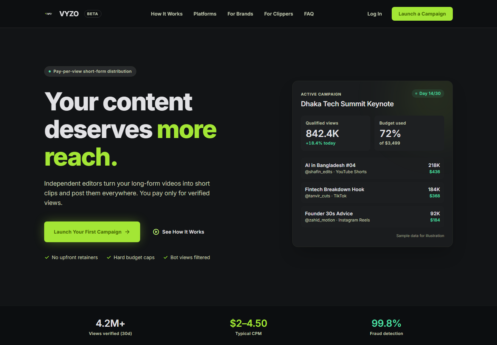
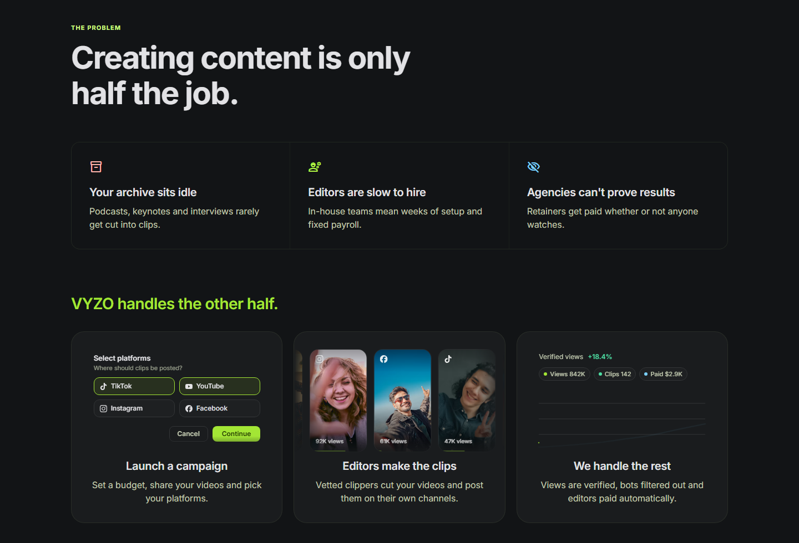
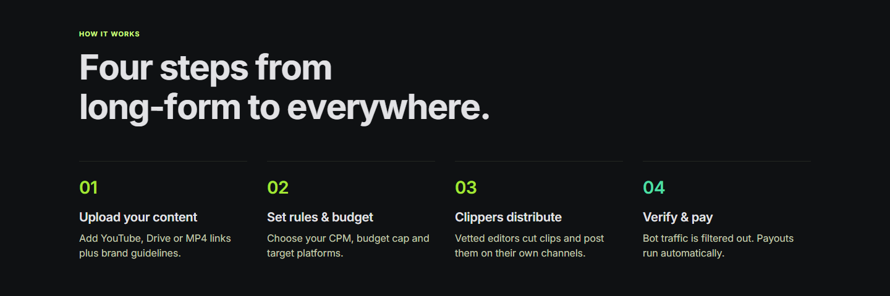
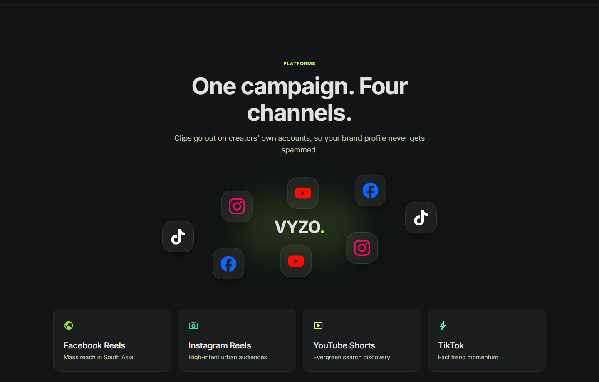
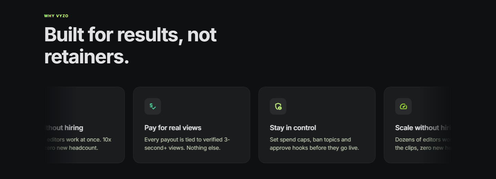
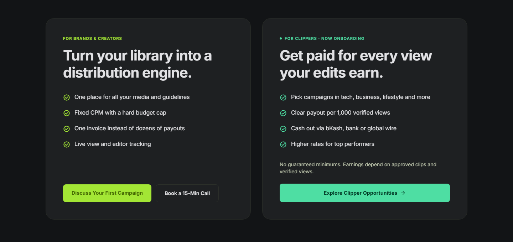
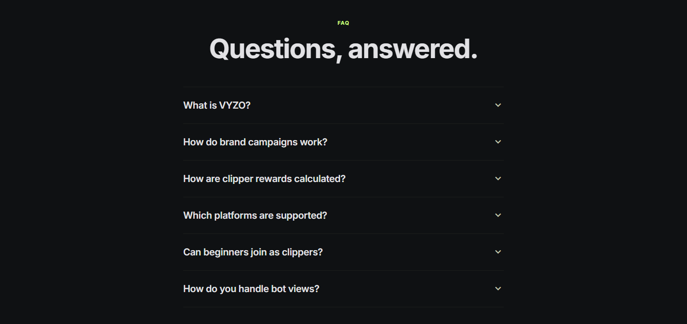
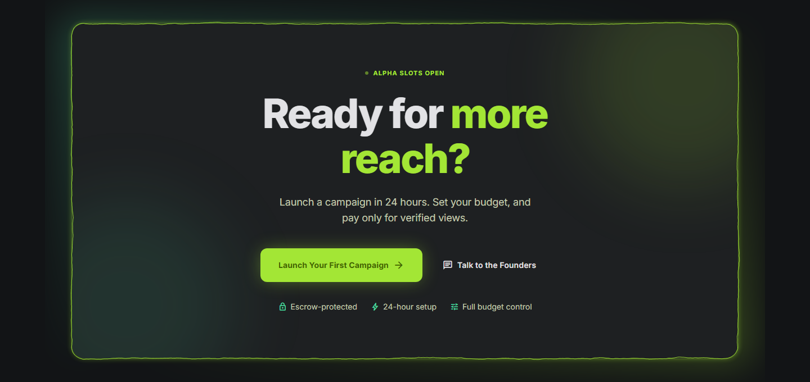
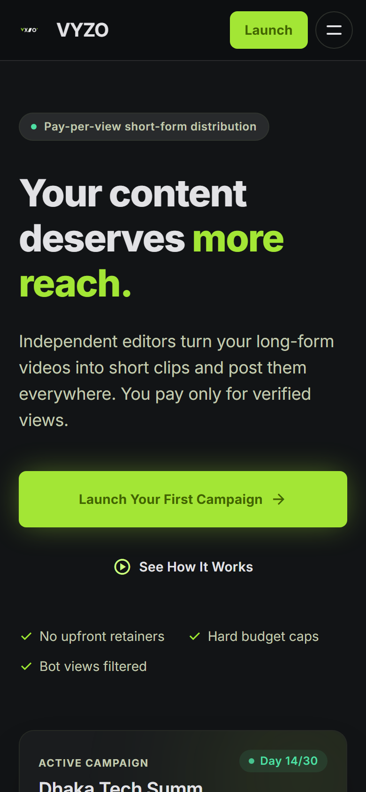
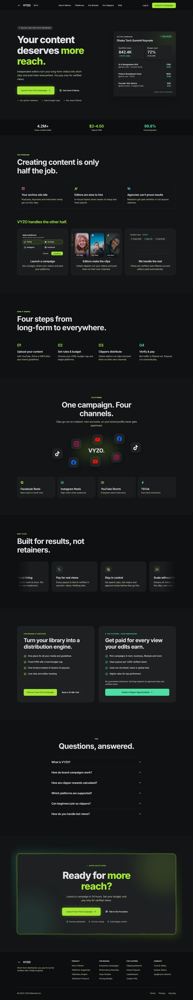

<div align="center">

# VYZO

### Pay-per-view short-form distribution

**Your content deserves more reach.**
Independent editors turn long-form videos into short clips and post them everywhere. Brands pay only for verified views.




</div>

---

## Overview

This repository holds the marketing landing page for **VYZO**, a marketplace that connects brands and creators with independent short-form editors ("clippers"). It is one static HTML page with a precompiled Tailwind stylesheet and vanilla JavaScript. There is no framework or bundler, and nothing needs to be built to run it.

| | |
|---|---|
| **For brands** | Upload long-form media, set a CPM and a hard budget cap, and pay only for verified 3-second+ views. |
| **For clippers** | Pick campaigns, cut and post clips on your own channels, and earn per 1,000 verified views. |
| **Platforms** | YouTube Shorts · TikTok · Instagram Reels · Facebook Reels |

---

## Page tour

<table>
  <tr>
    <td width="50%" valign="top">
      <b>1 · The problem → the solution</b><br/>
      <sub>Three pain points, then three animated demo cards: a platform picker with a clicking cursor, an endless clip strip and a self-drawing views chart.</sub><br/><br/>
      
    </td>
    <td width="50%" valign="top">
      <b>2 · How it works</b><br/>
      <sub>Four steps from long-form to everywhere. The heading folds in letter by letter as you scroll.</sub><br/><br/>
      
    </td>
  </tr>
  <tr>
    <td width="50%" valign="top">
      <b>3 · Platforms</b><br/>
      <sub>Platform logos orbit the VYZO mark along an elliptical path.</sub><br/><br/>
      
    </td>
    <td width="50%" valign="top">
      <b>4 · Why VYZO</b><br/>
      <sub>A benefits carousel that loops on its own and pauses on hover.</sub><br/><br/>
      
    </td>
  </tr>
  <tr>
    <td width="50%" valign="top">
      <b>5 · For brands &amp; for clippers</b><br/>
      <sub>Side-by-side value propositions for both sides of the marketplace.</sub><br/><br/>
      
    </td>
    <td width="50%" valign="top">
      <b>6 · FAQ</b><br/>
      <sub>An accessible accordion that uses <code>aria-expanded</code>.</sub><br/><br/>
      
    </td>
  </tr>
  <tr>
    <td colspan="2" valign="top">
      <b>7 · Call to action</b><br/>
      <sub>The final CTA card with an animated electric border.</sub><br/><br/>
      
    </td>
  </tr>
</table>

### Responsive

<table>
  <tr>
    <td width="300" valign="top"></td>
    <td valign="top">
      The layout is built mobile-first with Tailwind breakpoints (<code>sm</code> / <code>md</code> / <code>lg</code>).<br/><br/>
      • On small screens, a hamburger button morphs into an <b>X</b> and opens the menu.<br/>
      • Demo cards use <b>container queries</b> to shrink when they get narrow.<br/>
      • Every animation respects <code>prefers-reduced-motion</code>.
    </td>
  </tr>
</table>

<details>
<summary><b>📸 View the full page</b></summary>
<br/>

</details>

---

## Features

- ⚡ **Zero runtime dependencies.** Plain HTML, CSS and JavaScript, with only fonts and icons loaded from a CDN.
- 🎞️ **Hand-ported motion components.** Vanilla JavaScript versions of [React Bits](https://reactbits.dev) effects:
  - `FoldText` folds headings in character by character, triggered on scroll
  - `ElectricBorder` draws the animated canvas border on the CTA card
  - `LogoLoop` runs the infinite benefits carousel
  - `TiltedCard` adds a 3D tilt on hover
  - `OrbitImages` moves platform logos along a CSS `offset-path`
- 🎨 **Design tokens.** A full Material-style dark palette and type scale live in `tailwind.config.js`.
- ♿ **Accessibility.** The page uses ARIA states, visible focus rings, screen-reader text for animated headings and reduced-motion fallbacks.

---

## Getting started

Open the page directly:

```bash
start index.html
```

Or serve it locally, which is recommended so scroll animations and fonts behave as they do in production:

```bash
npx serve .
```

### Rebuilding the CSS

`styles.css` is generated from Tailwind. After you add or change utility classes in `index.html`, rebuild it:

```bash
npx tailwindcss@3.4.17 -i ./tailwind.css -o ./styles.css --minify
```

Then bump the `?v=` number on the `styles.css` link in `index.html` so browsers fetch the new file.

---

## Project structure

```
.
├── index.html            # The landing page: markup, component CSS and vanilla JS
├── styles.css            # Compiled + minified Tailwind output (generated)
├── tailwind.css          # Tailwind entry file (@tailwind directives)
├── tailwind.config.js    # Design tokens: colors, spacing, type scale
├── JH33QLwW.txt          # Earlier HTML export of the page (reference)
└── docs/
    └── screenshots/      # Images used in this README
```

---

## Design tokens

| Token | Hex | Use |
|---|---|---|
|  `primary-container` | `#a3e635` | Primary buttons, accents |
|  `secondary` | `#4edea3` | Success states, clipper CTA |
|  `tertiary-fixed-dim` | `#7bd0ff` | Info highlights |
|  `background` | `#121416` | Page background |
|  `surface-container` | `#1e2022` | Cards |
|  `on-surface` | `#e2e2e5` | Body text |

**Typography:** SF Pro on Apple devices (the system font) and Inter everywhere else, with a scale from `label-caps` (11px) up to `display-hero` (72px).

---

<div align="center">
<sub>Campaign figures shown on the page are sample data for illustration.</sub>
</div>
